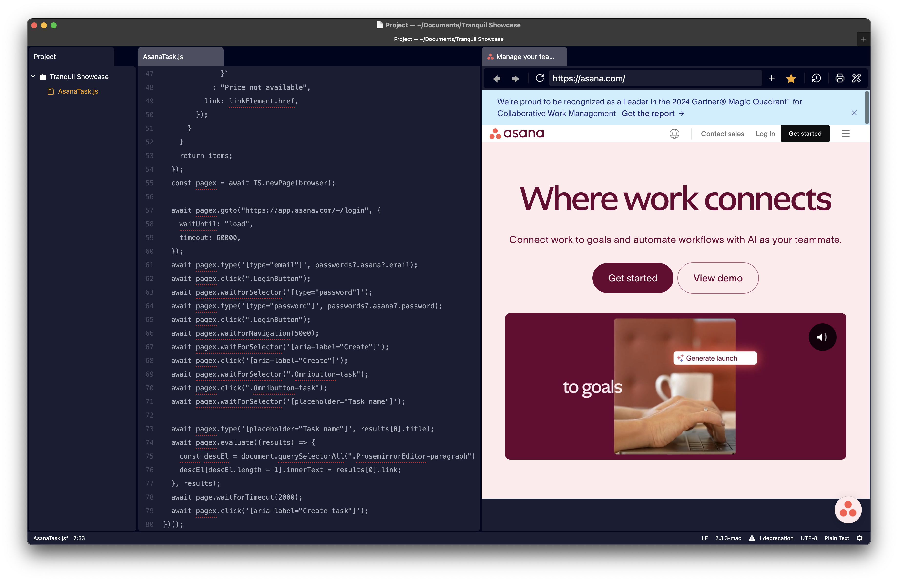

<h1 align="center">
 Designed for builders
</h1>

<h6 align="center">
  The Business <code>[automation | producutivity | organization | enablement | velocity | composability]</code> Platform
</h6>

  Tranquil fits into your workflow without friction or added complexity, allowing you to focus on what matters most: crafting high-quality deterministic business automations.

